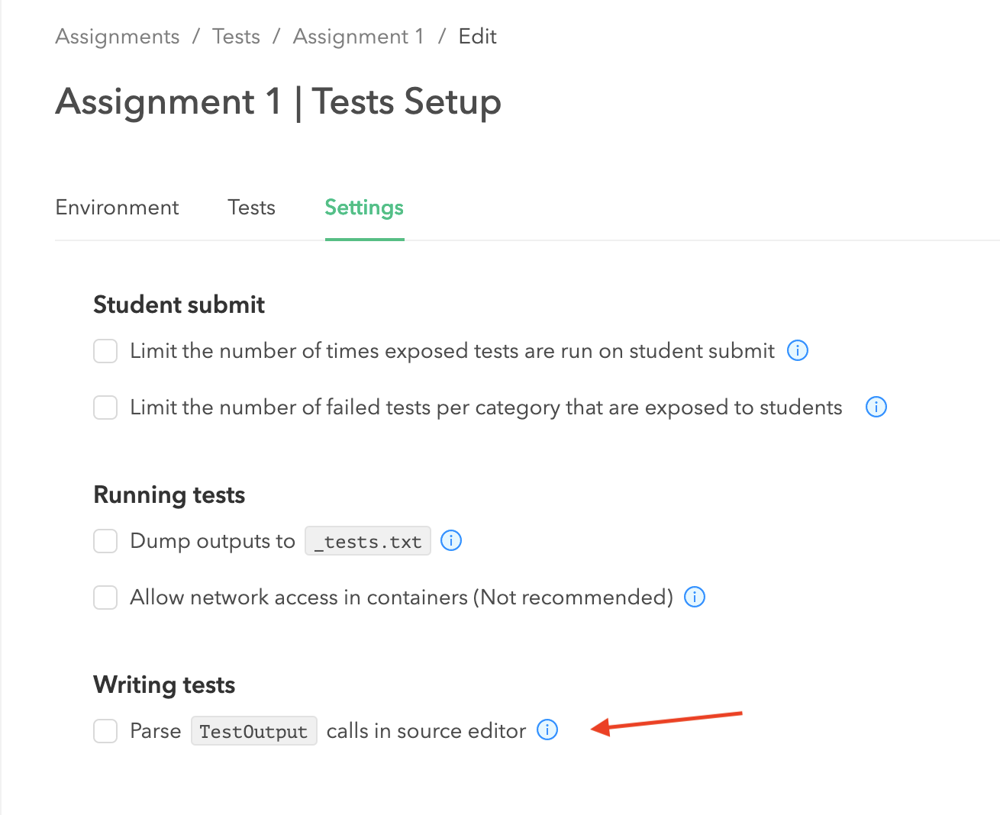

# agni

## Installation
Run the following commands to first install requirements using pip and then clone this repository and install it locally.
```
pip install pandas click toml codepost
git clone https://github.com/d3vp/agni
cd agni
pip install -e .
```

After installation, run the command to verify that it works:
```
$ agni
Usage: agni [OPTIONS] COMMAND [ARGS]...

  AGNI: Python autograder and Codepost companion.

Options:
  -h, --help  Show this message and exit.

Commands:
  new-assignment        Create new assignment directory structure.
  bundle-java           [Java] Bundle tests into a jar file and create runscript.
  bundle-python         [Python] Bundle tests into a zip file and create runscript.
  update-points         Update points of test cases on Codepost.
  download-submissions  Download student submissions from Codepost.
  create-tests          Create external tests on Codepost.
  delete-tests          Delete test cases on Codepost.
  run-external          Run external tests on student submissions.
  update-results        Update results of external tests on Codepost.
```

## Obtain API key from Codepost
- Go to this page and follow the instructions to obtain API Key: https://docs.codepost.io/docs/first-steps-with-the-codepost-python-sdk#2-obtaining-your-codepost-api-key
- Save the key at secure location and remember the path of the file e.g. `"~/.config/codepost/api_key.txt"`. This path will be required later. Just paste the key on one line in the file. 


## Create new assignment

First, we need to create an empty directory structure for a new assignment by running the following command:

```
$ agni new-assignment java examples/assignment1
```

This will create directory and files which should look as follows:

```
$ tree examples/assignment1/
examples/assignment1/
├── bundle/
├── config.toml
└── src/
    ├── helpers/
    ├── solutions/
    └── testcases/
        ├── TestRunner.java
        ├── exposed/
        └── secret/
```

- `config.toml` is the single settings/configuration file that is generated for the new assignment.
- All the solution java files should be put into `src/solutions/`. Make sure to put java files into their appropriate package directories. For example if `HelloWorld.java` has package `assignment1`, the path will be `src/solutions/assignment1/HelloWorld.java`.
- `src/helpers` directory should contain all the java files that are given to students along with assignment. These files, if any, are required for the program to work but students won't submit them on codepost.
- TAs will develop test cases in the directory `src/testcases`. For example, `src/testcases/exposed/` could have the exposed/public tests that will be shared with students, while `src/testcases/secret/` could contain the secret tests that will be executed after due date.


After tests are developed, the directory structure would look something like below, for example:

```
$ tree examples/assignment1/
examples/assignment1/
├── bundle/
├── config.toml
└── src/
    ├── helpers/
    │   └── assignment1/
    │       └── PrimeChecker.java
    ├── solutions/
    │   └── Author123/
    │       └── assignment1/
    │           └── MyPrimeChecker.java
    └── testcases/
        ├── TestRunner.java
        ├── exposed/
        │   └── assignment1/
        │       ├── IsPrime_TestSmall.java
        │       ├── IsPrime_ThrowsError.java
        │       ├── OtherTests_TimeoutInfiniteLoop.java
        │       └── StressTests_TestLargePrime.java
        └── secret/
```


## Developing test cases

You can use any IDE of your choice to develop test cases. You can choose the project directory as the assignment directory that was created using `new-assignment` command. In our example above, project directory would be `examples/assignment1/` that contains `src/`. Make sure to mark required folders as "source folders" in the IDE; in our example we need following to be the source folders:
- src/helpers
- src/solutions/Author123
- src/testcases
- src/testcases/exposed

Each test case is written individually in its own java file; it should be a public class that implements Runnable interface. Check java file in `examples/assignment1/testcases/exposed/assignment1/` for an example.

Filename for the test case should follow this format: `<TestCategory>_<TestName>.java`. This corresponds to Codepost tests structure, where test cases can be grouped into categories. In this way, AGNI can create categories on Codepost using the filenames.

There are two important settings that can be written directly into the test java file as a comment:
```
/* config
points = 1
timeout = 10000
*/
```
- `points` value is required for each test case; this value can be used to update point/grade for the test case on Codepost.
- `timeout` value (in milliseconds) is optional. If present, it overrrides `default-timeout` from `config.toml`. Each test cases is executed as separate Java process and the timeout value is the maximum amount of time for which the process will run before it times out.

After creating test cases, `src/testcases/TestRunner.java` can be executed which will run all the tests and the results can be seen in IDE. In this way, we can incrementally develop tests in IDE.

## Bundle tests into JAR file

After all tests have been developed in IDE, we bundle tests into a JAR file which can be then copied over to Codepost to run tests there.

First, set `default-timeout` in `config.toml` to a reasonable value. This timeout should be large enough (but not too large) so that each test is expected to finish within this time. If some test case requires more time, you can set its own `timeout` as explained above. In general, timeouts should be large enough allow most student's code except problems like infinite loops.

Next, go to the assignment directory and run `bundle-java` command:

```
cd examples/assignment1/

agni bundle-java src/testcases/exposed/ src/solutions/Author123/ bundle/assignment1
```

If needed, a single java file containing all the test can be generated; this file can be give to students for their local testing before they can submit to Codepost. To do this, run the command:
```
agni bundle-java src/testcases/exposed/ src/solutions/Author123/ bundle/assignment1 --gen-single-file Minitester.java
```

After successful bundling, following files will be generated:

```
$ tree -F bundle/
bundle/
└── assignment1/
    ├── Minitester.java
    ├── assignment1.jar
    ├── assignment1_codepost_runscript.sh
    ├── assignment1_commands.sh
    └── assignment1_metadata.json
```

## Running test cases on Codepost

1. Make sure the assignment has been created on Codepost. Then, in `config.toml` set the following values which come from codepost:

    ```
    [codepost]
    assignment_name = "Assignment 1"
    course_name = "COMP 250"
    course_period = "Fall 2020"
    api_key_path = "~/.config/codepost/api_key.txt"
    ```

2. Then, on Codepost, go to `Tests` -> `Create` (or `Edit`). This will lead to the following page:

    


3. Copy the contents of `assignment1_codepost_runscript.sh` to the textbox of section "2. Create a runscript" and click "Save":


4. Upload files from `src/helpers` to helpers on codepost (the section "3. Add helper files"). Upload the jar file and _commands.sh from `bundle/assignment1` directory to helpers on codepost.

5. Upload the solution java files from `src/solutions/Author123/` to "4. Add solution code" on Codepost.

6. In settings tab, uncheck the option shown below:

    

7. Enter file mode in Tests tab:

    

    Make sure, main.sh is selected and open. Then, click `Run` as shown in image below. After run completes, test categories and test cases should be created on the left as shown in the image below. Here, we are basically running all tests on the solution code so we must make sure all tests pass.

    

8. Update points on Codepost by running following AGNI command:
    ```
    $ agni update-points bundle/assignment1/
    ```


Finally, verify all is working well by choosing "Student" role on Codepost and submitting the solution as a student would.
